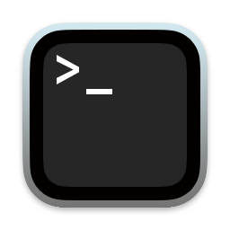

# CPGME Genome Analysis Pre-Workshop Setup

### May 4, 2022

*Egon A. Ozer, MD PhD (<e-ozer@northwestern.edu>)*  
*Ramon Lorenzo Redondo, PhD (<ramon.lorenzo@northwestern.edu>)*  
*Lacy M. Simons (<lacy.simons@northwestern.edu>)*

---
# Prerequisites
**_You don't need a computer to participate in this workshop, but parts of it will be more fun and enriching if you do._** The exercises we will be performing are designed to be easily and quickly run on laptop computers and the software installation requirements are minimal. If you are using a University-managed computer, you may need to get permission from IT to install the required software.
 

System | Minimum Requirements
--- | ---
MacOS | Version 10.13 or higher; 64-bit
Windows | Window 8 or newer; 64- or 32- bit
Linux | Ubuntu, RedHat, CentOS 7+ or others; 64-bit

_Don't try to use a tablet device like an iPad or Android!_ There may be hacks that allow for the installation of some of this software, but it's WAY out of the scope of this workshop and I don't recommend it. 

---
# Step 1 - Install Applications
This workshop will use a combination of **visual** (otherwise known as GUI or "point-and-click") software applications and **command-line** (or text or terminal) programs. We'll start by installing a few useful visual programs.

### Step 1.A - Tablet  
[Tablet](https://ics.hutton.ac.uk/tablet/) is a program that can be used to visualize and analyze read-based alignments against a reference sequence. 
 
* To install, go to this website: [https://ics.hutton.ac.uk/tablet/download-tablet/](https://ics.hutton.ac.uk/tablet/download-tablet/) to download and install the software appropriate for your system.

### Step 1.B - FigTree  
[FigTree](http://tree.bio.ed.ac.uk/software/figtree/) is a program to view phylogenetic trees. Files that can be viewed in FigTree generally end with the suffix `.tre` or `.nwk`.  

* To install, download the most recent version (v1.4.4) from this website: [https://github.com/rambaut/figtree/releases](https://github.com/rambaut/figtree/releases). 
* If you have a Mac, download the file ending with `.dmg`. Create a new folder in your Applications folder and drag all of the files into that folder.
* If you have a PC, download the file ending with `.zip`. Double-click and move all of the files into a new folder
* If you have Linux, download the file ending with `.tgz`. Double-click and move all of the files into a new folder.

### Step 1.C - SeaView  &nbsp;
[SeaView](http://doua.prabi.fr/software/seaview) is a program that can view and generate multiple sequence alignments of DNA and protein sequence as well as multiple other functions.

* To install, download the correct version for your computer from here: [http://doua.prabi.fr/software/seaview](http://doua.prabi.fr/software/seaview) and follow the instructions on that site for proper installation. 
* On Macs, you'll probably get a security alert when you try to open the program for the first time. To override this (it's OK!) open your _System Preferences_, click the _Security & Privacy_ icon, then click "Allow" next to SeaView in the window. Should be good to go.

### Step 1.D - Terminal &nbsp;&nbsp;  
You shouldn't need to install this. A Terminal program comes pre-installed on MacOS, Windows 10 and up, and Linux distributions. If your Windows version is older than 10, you may have to install it (more info [here](https://apps.microsoft.com/store/detail/windows-terminal/9N0DX20HK701?hl=en-us&gl=US)). Please take this opportunity to search for your Terminal program on your own system as you will need it for the next step.  

---

# Step 2 - Install Conda  
Conda is a software package manager that allows you to easily install much of the software required for this workshop on your computer. Software is installed into an "environment" that can be activated and deactivated from the command line. By setting up conda environments you can have multiple versions of the same software on one computer and (mostly) avoid conflicts between software packages. This will also allow you to easily install software and its prerequisites in one step. For a nice introduction to conda, see [this tutorial](https://towardsdatascience.com/a-guide-to-conda-environments-bc6180fc533) or [here](https://docs.conda.io/projects/conda/en/latest/index.html) for more detail. 

You can skip this step if you already have Anaconda or Miniconda installed. To check, perform **Step 2.C** below.

### Step 2.A - Download Miniconda installer:
System requirements and installer downloads for Mac, PC, and Linux can be found at [this site](https://docs.conda.io/en/latest/miniconda.html). The links below are for the latest Python 3.9 versions of the packages for each system:  

* Mac: [Miniconda3 macOS 64-bit pkg](https://repo.anaconda.com/miniconda/Miniconda3-py39_4.11.0-MacOSX-x86_64.pkg) (visual installer)
* Windows: [Miniconda3 Windows 64-bit](https://repo.anaconda.com/miniconda/Miniconda3-py39_4.11.0-Windows-x86_64.exe) 
* Linux: [Miniconda3 Linux 64-bit](https://repo.anaconda.com/miniconda/Miniconda3-latest-Linux-x86_64.sh)  

### Step 2.B - Install Miniconda:  

* Mac: Double-click the downloaded .pkg file. Accept all the default settings.
* Windows: Double click the downloaded .exe file. Accept all the default settings.
* Linux: In the terminal window, run

```
bash Miniconda3-latest-Linux-x86_64.sh
```

### Step 2.C - Verify installation:
Start the **Terminal** program on your computer (identified in Step 1.D above). In the Terminal program, type the following command:

```
conda list
```
If you see a list of installed packages in your Terminal window, you're good!  

---

# Step 3 - Install packages with Conda
Conda environments can be set up by 1) manually creating a new environment and then adding software packages to the environment one at a time, 2) listing the software you want added to the environment when you create it, or 3) by using a specially formatted `environment.yml` file to create the environnment and install all the correct packages in one step. We're going take approach #2. If you want more detail about setting up Conda environments, take a look [here](https://docs.conda.io/projects/conda/en/latest/user-guide/tasks/manage-environments.html).

### Step 3.A - Set up the `cpgme_workshop` environment: 
* First, open your **Terminal** application.  
* Second, copy or type the following command in the Terimnal: 

```
conda create \
  -y \
  -c conda-forge \
  -c bioconda \
  -n cpgme_workshop \
  prokka=1.14.6 \
  snippy=4.6.0 \
  snpEff=4 \
  ivar \
  iqtree \
  mafft \
  treetime \
  spades \
  blast \
  trimmomatic
```
* Hit enter to run the command. This should take several minutes to complete. 
* When the installation has finished and the command prompt reappears, type the following command to activate your environment:

```
conda activate cpgme_workshop
```
* You will know the environment is active if your commmand prompt now starts with `(cpgme_workshop)`.  
* To exit the conda environment, either close your Terminal or type the following command:

```
conda deactivate
```
---
# Next Steps and Troubleshooting
You should now be ready to complete the workshop. If you have any problems with the tasks above, please contact me at <e-ozer@northwestern.edu>.

  